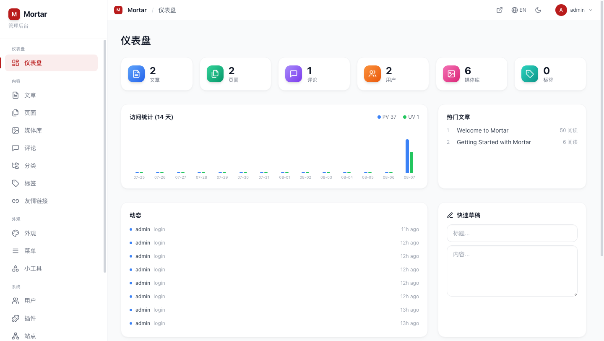
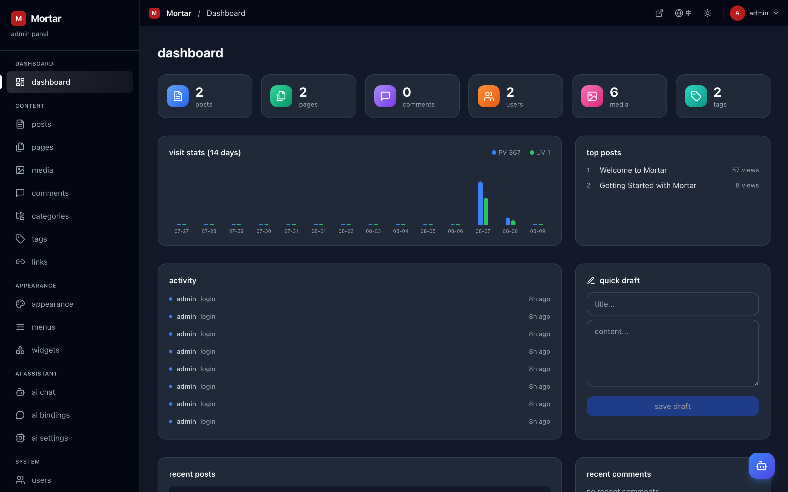
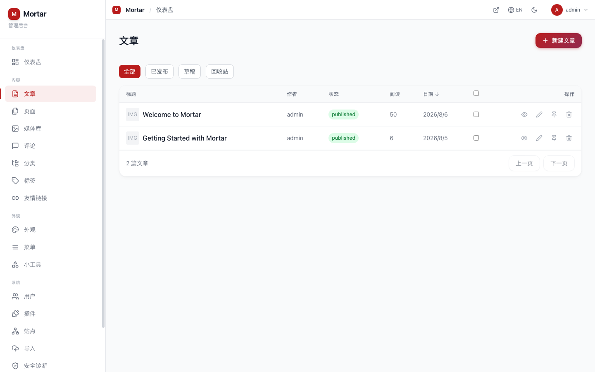
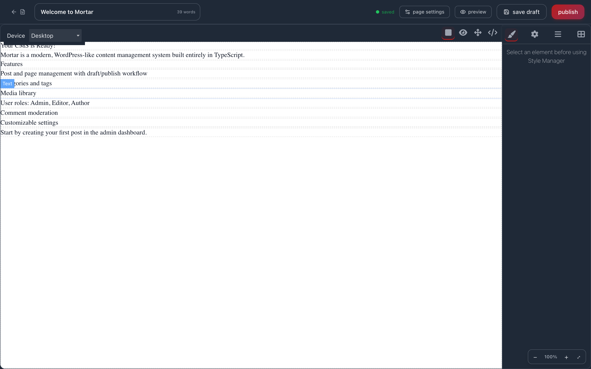
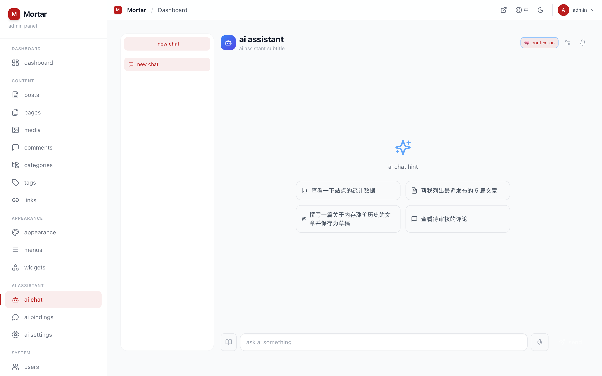
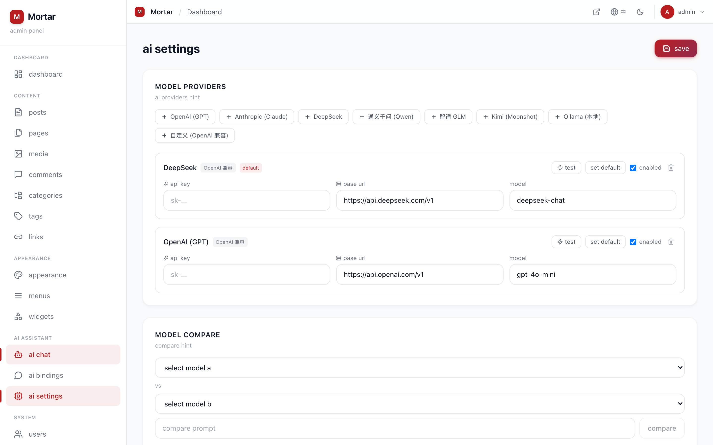
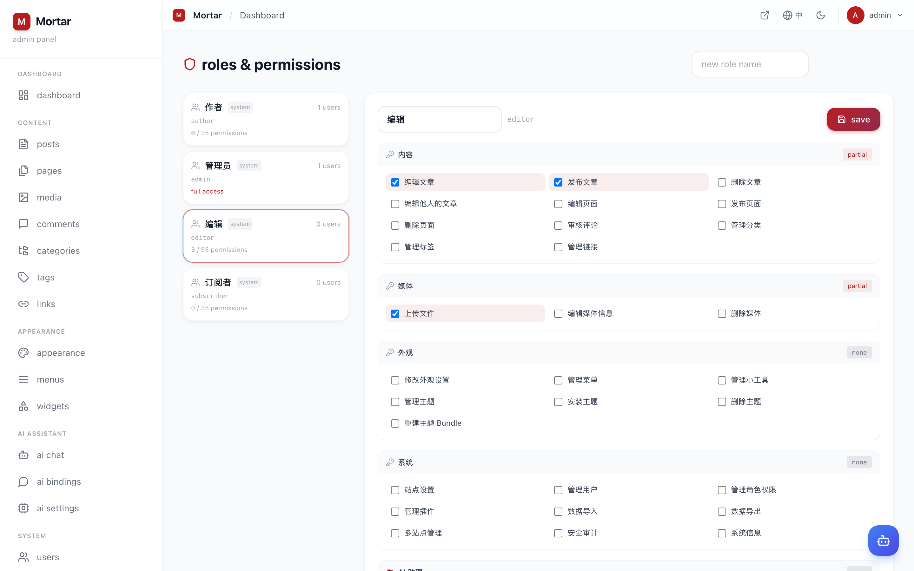
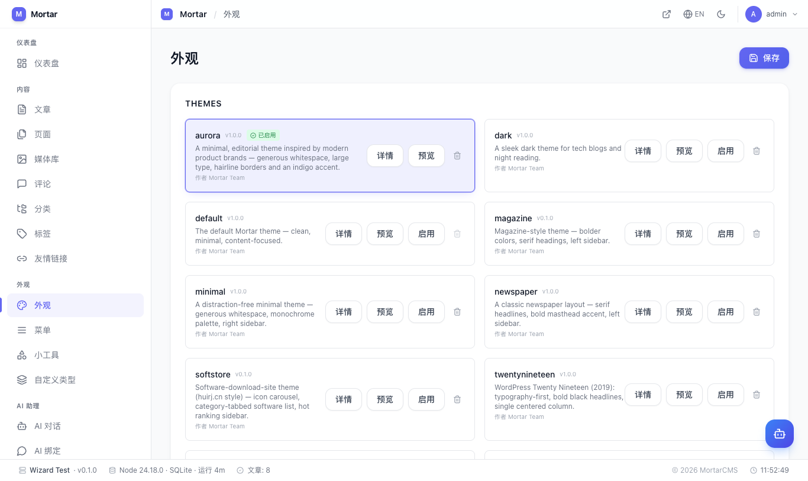

<p align="center">
  
  <h1 align="center">Mortar</h1>
  <p align="center">AI 驱动的现代化开源 CMS · 内置 AI 助理 / 可视化拖拽建站 / RBAC 权限体系 / 插件与主题生态</p>
  <p align="center"><em>AI-powered modern open-source CMS — built-in AI assistant, drag-and-drop visual builder, RBAC permissions, plugins & themes</em></p>
  <p align="center">
    <a href="https://github.com/huihongsoft/mortar"></a>
    <a href="https://github.com/huihongsoft/mortar/fork"></a>
    <a href="https://github.com/huihongsoft/mortar/issues"></a>
    <a href="LICENSE"></a>
    
    
    
    
  </p>
</p>

---

**Mortar** is a self-hosted content management system inspired by WordPress and Halo — with a built-in **AI assistant**, a **drag-and-drop visual page builder**, a **role-based permission system**, plugins, themes, and multi-site support, all in TypeScript.

## 🚀 一键安装 (One-click Install)

```bash
curl -fsSL https://raw.githubusercontent.com/huihongsoft/mortar/main/install.sh | bash
```

自动完成：环境检测 → 拉取代码 → 安装依赖 → 构建 → 注册系统服务（systemd / launchd）→ 健康检查。
安装后访问 `http://localhost:3001/install` 完成向导，再到 **AI 设置** 配置模型服务商即可使用 AI 助理。

> 支持 Linux / macOS；数据库默认 SQLite，也可通过 `DATABASE_URL` 使用 MySQL / PostgreSQL。
> 管理命令：`./mortarctl.sh {start|stop|restart|status|logs}`

## 📸 Screenshots

<p align="center">
  
  <br /><em>Dashboard — stats, PV/UV chart, quick draft, activity feed</em>
</p>

<p align="center">
  
  <br /><em>Dark mode — theme-color accents everywhere</em>
</p>

<p align="center">
  
  <br /><em>Posts — bulk actions, filters, AI batch translation</em>
</p>

<p align="center">
  
  <br /><em>Drag-and-drop visual builder — 23 blocks, live CMS data, real site styles</em>
</p>

<p align="center">
  
  <br /><em>AI assistant — streaming chat, tools, tasks, slash commands</em>
</p>

<p align="center">
  
  <br /><em>AI settings — 8 model providers, tool permissions, usage stats</em>
</p>

<p align="center">
  
  <br /><em>Roles & permissions — 35 capabilities across 5 groups, incl. AI</em>
</p>

<p align="center">
  
  <br /><em>Appearance — themes, custom CSS, visual theme sections</em>
</p>

## ✨ Features

### Content
- Posts & pages with categories, tags, and custom post types
- Three-mode editor: **Rich text (TipTap) / Markdown / HTML**, with block templates & custom HTML blocks
- **Drag-and-drop visual builder** (GrapesJS): 23 blocks (layout / content / sections / live CMS data), property panel (typography, spacing, layout, effects), canvas zoom, block search, templates, real site CSS preview
- Revisions history with side-by-side diff, trash & bulk actions, sticky, scheduled, private & password-protected posts
- Shortcode system (`[gallery]`, `[audio]`, `[video]`, custom) with a plugin API, gallery lightbox
- Per-post **SEO panel** with Google-style search preview (title / description / JSON-LD)

### AI Assistant
- **Chat**: multi-session streaming chat with Markdown rendering, voice input, prompt library, slash commands (`/stats`, `/posts`, `/draft 主题`, ...), copy / regenerate / stop, dark mode
- **Agent tools** (15): site stats, post CRUD, full-site content search (RAG), web search, image generation, image understanding, comment review, translation, draft auto-completion, long-term memory
- **Async tasks**: background agent runs with step tracking, cancel / retry, completion notifications, scheduled tasks (interval / daily / weekly)
- **8 model providers**: OpenAI, Anthropic Claude, DeepSeek, Qwen, GLM, Kimi, Ollama, custom — with test connection, model comparison, usage statistics
- **WeChat / DingTalk bindings**: users message a bot → AI acts with their identity & permissions via webhook
- **Sandboxed**: every tool call is audited, AI-generated HTML is sanitized, prompt-injection guarded, per-role tool permissions

### Roles & Permissions (RBAC)
- Role manager: built-in (admin / editor / author / subscriber) + custom roles
- **35 capabilities** across 内容 / 媒体 / 外观 / 系统 / **AI 助理** — enforced server-side via the DB-backed role table
- Per-user role assignment; admin is locked to full access

### Platform
- **Plugin system**: hooks (actions/filters), lifecycle (activate/deactivate/uninstall), local market + remote repository install
- **Theme system**: theme directory (`server/themes/`), one-click switching, per-theme settings, custom CSS editor, CSS-variable theming, **visual theme sections** (drag-and-drop blocks injected at header/footer hooks), one-click bundle rebuild
- **Multi-site**: domain-based site resolution, per-site settings, menus & widgets, content isolation

### Media & Performance
- Media library with thumbnails, responsive images (srcset), WebP/AVIF conversion via sharp
- CDN URL rewriting, lazy loading, HTTP caching, DB indexes, code-splitting

### SEO & i18n
- Per-page SEO (title/description/OG/Twitter/canonical), sitemap, robots.txt, JSON-LD structured data (Article, BreadcrumbList)
- Full **Chinese/English** UI localization (admin & frontend)

### Admin Panel
- WordPress-style layout: grouped sidebar, admin bar, light/dark mode, theme-color follow
- Dashboard with PV/UV stats, top posts, quick draft, activity feed
- Security audit (Site Health style), system info, full backup & restore
- Categories/Tags/Links management, comment moderation, WXR import/export

### Security
- JWT auth with server-side logout (token blacklist), 2FA (TOTP) with login challenge
- Login lockout + rate limiting, password strength policy
- Security headers, upload MIME allowlist + content verification, GDPR export/erase
- Installation wizard with database selection — anonymous reset is blocked (admin only)

## 🚀 Quick Start

### Requirements
- Node.js ≥ 18
- npm ≥ 9

### Install & run — 方式 A：一键安装（推荐）

```bash
curl -fsSL https://raw.githubusercontent.com/huihongsoft/mortar/main/install.sh | bash
```

自动完成：环境检测 → 拉取代码 → 安装依赖 → 构建 → 注册系统服务（systemd / launchd）→ 健康检查。
安装后访问 `http://localhost:3001/install` 完成向导即可使用。

### Install & run — 方式 B：手动安装

```bash
# 1. 获取代码
git clone https://github.com/huihongsoft/mortar.git && cd mortar

# 2. 安装依赖（三个工作区）
(cd server   && npm install --no-audit --no-fund)
(cd admin    && npm install --no-audit --no-fund)
(cd frontend && npm install --no-audit --no-fund)

# 3. 构建并启动
./build.sh
# Admin:  http://localhost:3001/admin
# Site:   http://localhost:3001
```

### Development

```bash
npm run dev            # 开发模式：server (3001) + admin (3002) + frontend (3000)
# 或生产模式（需先构建）
(cd server && NODE_ENV=production node dist/index.js)
```

### First run — install wizard

Visit `http://localhost:3001/install` on first launch:

1. Choose a database — **SQLite** (default, zero-config) / **MySQL/MariaDB** / **PostgreSQL**
2. Enter site title & admin account
3. Done — log in at `/admin`

You can switch databases later from the admin panel (System Info → Switch database).

## 🗄️ Database

| Engine | Support | Notes |
|--------|---------|-------|
| SQLite | ✅ Default | Single file at `server/data/mortar.db` |
| MySQL / MariaDB | ✅ | Auto-creates the database (utf8mb4) |
| PostgreSQL | ✅ | Full dialect support |

Configuration via `DATABASE_URL` env or the install wizard. See [docs/deployment.md](docs/deployment.md).

## 🧱 Tech Stack

| Layer | Technology |
|-------|-----------|
| Backend | Node.js, Express, better-sqlite3 / mysql2 / pg, zod, JWT, sharp |
| Frontend | React 18, React Router, Vite, Tailwind CSS, TipTap, markdown-it, GrapesJS (visual builder) |
| Tooling | TypeScript 5, tsx, Prisma (schema reference) |

## 📚 Documentation

- [Architecture](docs/architecture.md) — directory layout & data model
- [API Overview](docs/api.md) — route map & authentication
- [Plugins](docs/plugins.md) — hooks, lifecycle, market
- [Themes](docs/themes.md) — theme structure & settings
- [Deployment](docs/deployment.md) — environment, proxy, backup
- [Development](docs/development.md) — local setup & contribution workflow

### AI Setup

1. Open **AI 设置** (`/admin/ai/settings`), pick a provider (DeepSeek / Qwen / GLM offer free credits), paste your API key, click **测试**, then **设为默认**
2. Open **AI 对话** (`/admin/ai`) and try: *"写一篇关于内存涨价历史的文章并保存为草稿"*
3. Grant AI access per role in **角色与权限** (`/admin/roles`) — capability `ai_use`

## 🤝 Contributing

Contributions are welcome! Please read [CONTRIBUTING.md](CONTRIBUTING.md) and our [Code of Conduct](CODE_OF_CONDUCT.md) first.

## 🔒 Security

Found a vulnerability? See [SECURITY.md](SECURITY.md) for the responsible disclosure process.

## 📄 License

[Mortar](LICENSE) is licensed under the **Creative Commons Attribution-NonCommercial-ShareAlike 4.0 International (CC BY-NC-SA 4.0)**.

- **NonCommercial**: this project may not be used for commercial purposes.
  Commercial use requires a separate license — contact the maintainers.
- **ShareAlike**: derivatives must be distributed under the same license.
- **Attribution**: credit the original authors when sharing or adapting.

For commercial licensing inquiries, please open an issue on GitHub.
